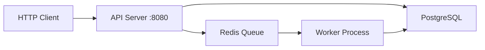

## System architecture

Boiler-Go is designed as a distributed system with two main processes:



### Components

<CardGroup cols={2}>
  <Card title="API Server" icon="server">
    Handles HTTP requests, validates input, and enqueues background tasks
  </Card>
  <Card title="Worker Process" icon="gears">
    Processes asynchronous tasks from Redis queues with retry logic
  </Card>
  <Card title="PostgreSQL" icon="database">
    Persistent data storage with connection pooling
  </Card>
  <Card title="Redis" icon="bolt">
    Task queue and caching layer using Asynq
  </Card>
</CardGroup>

## Project structure

Boiler-Go follows Go's standard project layout with clear separation of concerns:

```
boiler-go/
├── cmd/
│   ├── api/                 # HTTP API server entry point
│   │   └── main.go
│   └── worker/              # Background job processor entry point
│       └── main.go
├── internal/
│   ├── config/              # Environment configuration with validation
│   │   └── config.go
│   ├── db/                  # Thread-safe database connection pool
│   │   ├── db.go
│   │   ├── models.go
│   │   └── pool.go
│   ├── handler/             # HTTP request handlers
│   │   ├── health.go
│   │   ├── router.go
│   │   └── worker.go
│   ├── middleware/          # HTTP middleware (logging, CORS, recovery)
│   │   └── logger.go
│   ├── queue/               # Shared queue names and priority configuration
│   │   └── queue.go
│   ├── scheduler/           # Job scheduling client (Asynq wrapper)
│   │   └── client.go
│   └── tasks/               # Shared task type constants
│       └── tasks.go
├── pkg/
│   └── logger/              # Structured logging utilities with global fallback
│       ├── echocontext.go
│       └── logger.go
├── migrations/              # Database migration files (golang-migrate)
├── sql/                     # SQL schema and queries for sqlc
├── Makefile                 # Development commands
├── docker-compose.yml       # Local infrastructure (PostgreSQL + Redis)
├── go.mod                   # Go module definition
└── .env                     # Environment configuration
```

### Package responsibilities

<AccordionGroup>
  <Accordion title="cmd/ - Application entry points">
    Contains the `main.go` files for each executable:
    
    - **cmd/api/main.go** - Initializes the HTTP server, database, Redis, and scheduler client
    - **cmd/worker/main.go** - Initializes the worker process and registers task handlers
    
    Both share the same internal packages and configuration.
  </Accordion>
  
  <Accordion title="internal/config - Configuration management">
    Loads and validates environment variables:
    
    ```go internal/config/config.go
    type Config struct {
        // server
        AppPort string `env:"APP_PORT" envDefault:"8080"`
        
        // database
        DatabaseURL string `env:"DATABASE_URL,required"`
        
        // redis / asynq
        RedisAddr     string `env:"REDIS_ADDR,required"`
        RedisPassword string `env:"REDIS_PASSWORD"`
        RedisDB       int    `env:"REDIS_DB" envDefault:"0"`
        
        // timeouts
        HealthCheckTimeout    time.Duration `env:"HEALTH_CHECK_TIMEOUT" envDefault:"2s"`
        APIShutdownTimeout    time.Duration `env:"API_SHUTDOWN_TIMEOUT" envDefault:"10s"`
        WorkerShutdownTimeout time.Duration `env:"WORKER_SHUTDOWN_TIMEOUT" envDefault:"30s"`
        
        // logging
        LogOutput string `env:"LOG_OUTPUT" envDefault:"stdout"`
        LogFile   string `env:"LOG_FILE"`
    }
    ```
    
    Key features:
    - Uses `sync.Once` for thread-safe singleton initialization
    - Validates URLs, ports, and timeout values
    - Fails fast with structured logging on invalid configuration
  </Accordion>
  
  <Accordion title="internal/db - Database connection pool">
    Thread-safe PostgreSQL connection management:
    
    ```go internal/db/pool.go
    var (
        pool *pgxpool.Pool
        mu   sync.RWMutex
    )
    
    // Open initializes the database pool with timeout control
    func Open(ctx context.Context, cfg *config.Config) error {
        mu.Lock()
        defer mu.Unlock()
        
        poolConfig, err := pgxpool.ParseConfig(cfg.DatabaseURL)
        if err != nil {
            return fmt.Errorf("failed to parse database config: %w", err)
        }
        poolConfig.MaxConns = 15
        poolConfig.MinConns = 2
        poolConfig.MaxConnLifetime = 30 * time.Minute
        poolConfig.MaxConnIdleTime = 5 * time.Minute
        poolConfig.HealthCheckPeriod = 1 * time.Minute
        
        newPool, err := pgxpool.NewWithConfig(ctx, poolConfig)
        if err != nil {
            return fmt.Errorf("failed to create pool: %w", err)
        }
        
        if err := newPool.Ping(ctx); err != nil {
            newPool.Close()
            return fmt.Errorf("database unreachable: %w", err)
        }
        
        pool = newPool
        return nil
    }
    
    func Get() *pgxpool.Pool {
        mu.RLock()
        defer mu.RUnlock()
        return pool
    }
    ```
    
    Key features:
    - Thread-safe with `sync.RWMutex`
    - Context-aware initialization
    - Production-ready pool configuration
    - Automatic health checks
  </Accordion>
  
  <Accordion title="internal/handler - HTTP handlers">
    HTTP request handlers built on Echo framework:
    
    ```go internal/handler/router.go
    func NewRouter(log zerolog.Logger, cfg *config.Config, db *pgxpool.Pool, 
                   redis *redis.Client, scheduler *scheduler.Client) http.Handler {
        e := echo.New()
        e.HideBanner = true
        e.HidePort = true
        
        // Middleware
        e.Use(echomiddleware.Recover())
        e.Use(echomiddleware.CORSWithConfig(echomiddleware.CORSConfig{
            AllowOrigins:     []string{"*"},
            AllowMethods:     []string{http.MethodGet, http.MethodPost, http.MethodPut, http.MethodDelete},
            AllowHeaders:     []string{"Accept", "Authorization", "Content-Type", "X-Request-ID"},
            ExposeHeaders:    []string{"Link", "X-Request-ID"},
            AllowCredentials: false,
            MaxAge:           300,
        }))
        e.Use(custommiddleware.RequestLogger(log))
        
        // Routes
        health := NewHealthHandler(db, redis, cfg.HealthCheckTimeout)
        worker := NewWorkerHandler(scheduler)
        
        e.GET("/health", health.Check)
        
        workerGroup := e.Group("/worker")
        workerGroup.GET("/status", worker.Status)
        workerGroup.POST("/ping", worker.Ping)
        
        return e
    }
    ```
  </Accordion>
  
  <Accordion title="internal/middleware - HTTP middleware">
    Request logging and request ID injection:
    
    ```go internal/middleware/logger.go
    func RequestLogger(base zerolog.Logger) echo.MiddlewareFunc {
        return func(next echo.HandlerFunc) echo.HandlerFunc {
            return func(c echo.Context) error {
                start := time.Now()
                
                // Get or generate request ID
                reqID := c.Request().Header.Get("X-Request-ID")
                if reqID == "" {
                    reqID = uuid.NewString()
                }
                
                // Set request ID on response header
                c.Response().Header().Set("X-Request-ID", reqID)
                
                // Create request-scoped logger
                reqLogger := base.With().
                    Str("request_id", reqID).
                    Str("method", c.Request().Method).
                    Str("path", c.Request().URL.Path).
                    Logger()
                
                // Inject logger into echo.Context
                c.Set("logger", reqLogger)
                
                // Execute next handler
                err := next(c)
                
                // Log request completion
                reqLogger.Info().
                    Dur("duration", time.Since(start)).
                    Int("status", c.Response().Status).
                    Msg("request completed")
                
                return err
            }
        }
    }
    ```
    
    Key features:
    - Generates or uses existing `X-Request-ID` header
    - Injects request-scoped logger into context
    - Logs request completion with duration
  </Accordion>
  
  <Accordion title="pkg/logger - Structured logging">
    Zerolog-based logging utilities:
    
    ```go pkg/logger/logger.go
    func New() zerolog.Logger {
        return NewWithOutput(OutputConfig{Stdout: true, StdoutOnly: true})
    }
    
    func NewWithOutput(cfg OutputConfig) zerolog.Logger {
        var writers []io.Writer
        
        if cfg.Stdout || cfg.StdoutOnly {
            writers = append(writers, zerolog.ConsoleWriter{
                Out:        os.Stdout,
                TimeFormat: "2006-01-02 15:04:05",
            })
        }
        
        if !cfg.StdoutOnly && cfg.FilePath != "" {
            file, err := os.OpenFile(cfg.FilePath, os.O_CREATE|os.O_WRONLY|os.O_APPEND, 0666)
            if err != nil {
                fmt.Fprintf(os.Stderr, "failed to open log file: %v\n", err)
                return zerolog.New(os.Stdout).With().Timestamp().Logger().Level(zerolog.InfoLevel)
            }
            writers = append(writers, file)
        }
        
        // Multi-writer for both stdout and file
        output := zerolog.MultiLevelWriter(writers...)
        return zerolog.New(output).With().Timestamp().Logger().Level(zerolog.InfoLevel)
    }
    ```
  </Accordion>
</AccordionGroup>

## Request flow

Here's how a typical HTTP request flows through the system:

<Steps>
  <Step title="Client sends request">
    ```bash
    curl -X POST http://localhost:8080/worker/ping \
      -H "Content-Type: application/json" \
      -H "X-Request-ID: req-12345" \
      -d '{"message": "test"}'
    ```
  </Step>
  
  <Step title="Middleware processes request">
    The `RequestLogger` middleware:
    1. Extracts or generates a request ID: `req-12345`
    2. Creates a request-scoped logger with the request ID
    3. Injects the logger into Echo context
    4. Sets `X-Request-ID` header on response
    
    ```
    2024-03-03 10:18:00 INF request_id=req-12345 method=POST path=/worker/ping
    ```
  </Step>
  
  <Step title="Handler processes request">
    The `WorkerHandler.Ping` handler:
    1. Extracts the logger from context
    2. Validates request body
    3. Creates task payload with request ID
    4. Enqueues task to Redis
    
    ```go internal/handler/worker.go
    func (h *WorkerHandler) Ping(c echo.Context) error {
        log := logger.FromEchoContext(c)
        requestID := c.Request().Header.Get("X-Request-ID")
        
        payload := PingTaskPayload{
            Message:   "test",
            RequestID: requestID,
            QueuedAt:  time.Now().UTC(),
        }
        
        taskID, err := h.scheduler.EnqueueWithID(ctx, tasks.TypeWorkerPing, payloadBytes)
        
        log.Info().
            Str("task_id", taskID).
            Str("request_id", requestID).
            Msg("worker ping task enqueued")
        
        return c.JSON(http.StatusAccepted, PingResponse{...})
    }
    ```
  </Step>
  
  <Step title="Worker processes task">
    The worker process:
    1. Pulls task from Redis queue
    2. Logs task start with task ID
    3. Parses payload to extract request ID
    4. Processes task with request ID in logs
    5. Logs task completion with duration
    
    ```
    2024-03-03 10:18:00 INF task started task_id=a1b2c3d4 task_type=worker:ping
    2024-03-03 10:18:00 INF worker ping task processed - worker is alive! \
                            payload=test request_id=req-12345 task_type=worker:ping
    2024-03-03 10:18:00 INF task completed duration=2ms task_id=a1b2c3d4 task_type=worker:ping
    ```
  </Step>
  
  <Step title="Response sent to client">
    ```json
    {
      "success": true,
      "task_id": "a1b2c3d4-e5f6-7890-abcd-ef1234567890",
      "task_type": "worker:ping",
      "queued_at": "2024-03-03T10:18:00Z",
      "message": "Task queued successfully. Check worker logs to verify processing."
    }
    ```
  </Step>
</Steps>

<Note>
  Notice how the request ID flows from the HTTP request through to the worker logs. This enables end-to-end request tracing across distributed processes.
</Note>

## Design patterns

Boiler-Go implements several production-ready patterns:

### Shared constants pattern

Task types and queue names are defined in dedicated packages to ensure consistency:

```go internal/tasks/tasks.go
package tasks

const TypeWorkerPing = "worker:ping"
```

```go internal/queue/queue.go
package queue

const (
    QueueCritical = "critical"
    QueueDefault  = "default"
    QueueLow      = "low"
)

func Names() []string {
    return []string{QueueCritical, QueueDefault, QueueLow}
}

func Priorities() map[string]int {
    return map[string]int{
        QueueCritical: 6,
        QueueDefault:  3,
        QueueLow:      1,
    }
}
```

Both the API handler and worker import these packages, ensuring they always use the same identifiers.

### Context-aware initialization

All external connections accept a context for timeout control:

```go cmd/api/main.go
dbCtx, dbCancel := context.WithTimeout(context.Background(), 10*time.Second)
defer dbCancel()

if err := db.Open(dbCtx, cfg); err != nil {
    logg.Fatal().Err(err).Msg("failed to initialize database")
}
```

This prevents the application from hanging indefinitely during startup if a service is unavailable.

### Logger injection pattern

The configuration loader accepts a logger for structured logging:

```go cmd/api/main.go
logg := logger.New()
cfg := config.Load(logg)  // Uses structured logging, not stdlib log
```

This ensures consistent log formatting throughout the application lifecycle.

### Graceful shutdown pattern

Both processes handle shutdown gracefully with timeout enforcement:

```go cmd/api/main.go
// Setup signal handling
sigChan := make(chan os.Signal, 1)
signal.Notify(sigChan, os.Interrupt, syscall.SIGTERM)

select {
case err := <-serverErrors:
    logg.Fatal().Err(err).Msg("server startup failed")
case sig := <-sigChan:
    logg.Info().Str("signal", sig.String()).Msg("shutdown signal received")
}

// Graceful shutdown with timeout
shutdownCtx, cancel := context.WithTimeout(context.Background(), cfg.APIShutdownTimeout)
defer cancel()

if err := server.Shutdown(shutdownCtx); err != nil {
    logg.Error().Err(err).Msg("server shutdown failed")
} else {
    logg.Info().Msg("server shutdown completed gracefully")
}
```

The worker uses a more complex pattern to handle in-flight tasks:

```go cmd/worker/main.go
// Stop accepting new tasks
srv.Stop()

// Shutdown with timeout enforcement
shutdownCtx, cancel := context.WithTimeout(context.Background(), cfg.WorkerShutdownTimeout)
defer cancel()

done := make(chan struct{})
go func() {
    srv.Shutdown()  // Blocks until in-flight tasks complete
    close(done)
}()

select {
case <-done:
    logg.Info().Msg("worker shutdown completed gracefully")
case <-shutdownCtx.Done():
    logg.Warn().Msg("worker shutdown timed out, forcing exit")
}
```

## Health monitoring

The health check endpoint provides service status with duration tracking:

```go internal/handler/health.go
func (h *HealthHandler) Check(c echo.Context) error {
    start := time.Now()
    ctx, cancel := context.WithTimeout(c.Request().Context(), h.timeout)
    defer cancel()
    
    status := echo.Map{
        "database": "up",
        "redis":    "up",
    }
    overall := http.StatusOK
    
    if err := h.db.Ping(ctx); err != nil {
        log.Error().Err(err).Msg("database health check failed")
        status["database"] = "down"
        overall = http.StatusServiceUnavailable
    }
    
    if err := h.redis.Ping(ctx).Err(); err != nil {
        log.Error().Err(err).Msg("redis health check failed")
        status["redis"] = "down"
        overall = http.StatusServiceUnavailable
    }
    
    return c.JSON(overall, echo.Map{
        "status":   status,
        "checked":  time.Now().UTC(),
        "duration": time.Since(start).Milliseconds(),
    })
}
```

<Tip>
  The health check endpoint is safe for frequent polling by load balancers. It does not enqueue background jobs or perform expensive operations.
</Tip>

## Next steps

<CardGroup cols={2}>
  <Card title="Configuration" icon="gear" href="/configuration">
    Learn how to configure timeouts, logging, and other settings
  </Card>
  <Card title="API reference" icon="code" href="/api-reference">
    Explore all available endpoints
  </Card>
  <Card title="Add handlers" icon="plus" href="/guides/adding-handlers">
    Create your first custom endpoint
  </Card>
  <Card title="Add tasks" icon="list-check" href="/guides/adding-tasks">
    Implement custom background jobs
  </Card>
</CardGroup>